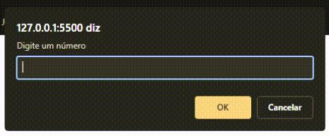

# Explorer | Stage 04 - Exercício 01

Exercício de JavaScript sobre o uso de operadores matemáticos

## Desafio solicitado

Nesse desafio, você irá solicitar ao usuário que ele insira **dois números** e, a partir daí, calcular:

-   [x] A soma dos dois números;
-   [x] A subtração dos dois números;
-   [x] A multiplicação dos dois números;
-   [x] A divisão dos dois números;
-   [x] O resto da divisão dos dois números;

Bora se desafiar?

-   [x] Verifique se a soma dos dois números é par ~~(ou ímpar)~~;
-   [x] Verifique se os dois números inseridos são iguais ~~(ou diferentes)~~.

